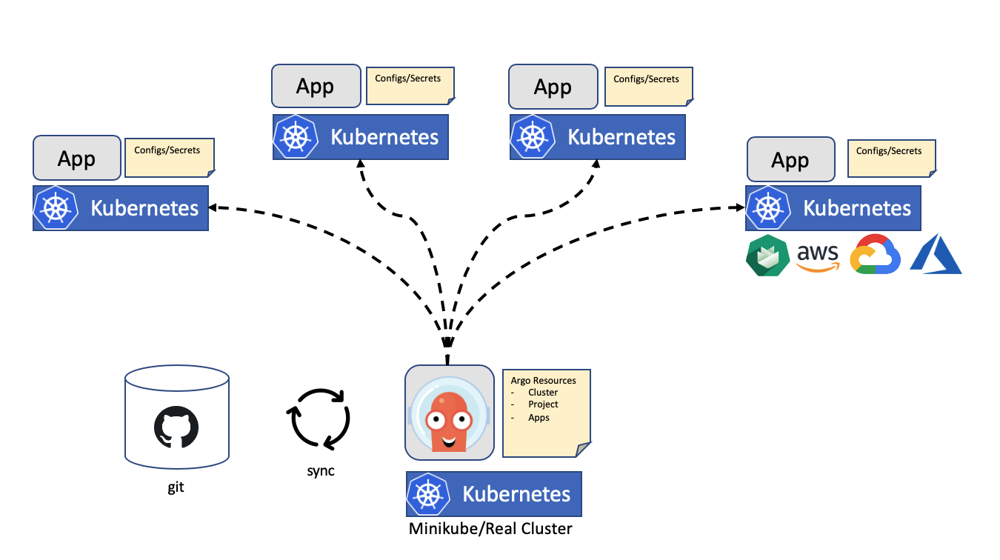

# argo-bootstrap

This project helps you setup the [Argo](https://argoproj.github.io/) suite on a Kubernetes cluster.

## Overview

The goal of this setup to deploy Argo centrally onto a Kubernetes cluster and then roll out applications to a set of Kubernetes clusters.



## Installation

Follow those steps to setup an Argo environment.

### Minikube/Cluster Setup

First we need a Kubernetes cluster. All viable options should work here. The cluster should have connectivity to the clusters we want to deploy into. For our local setup we will go with a `minikube` setup

```shell
minikube start --vm-provider=virtualbox
```

Alternatively a [kind](https://github.com/kubernetes-sigs/kind) cluster can be used for a more ad-hoc test setup.

```shell
kind create cluster
```

We assume that the target cluster have been created prior to our Argo setup.

### Deploy ArgoCD

Now it's time to deploy the latest stable release of ArgoCD into our cluster.

```shell
kubectl create namespace argocd
kubectl apply -n argocd -f https://raw.githubusercontent.com/argoproj/argo-cd/stable/manifests/install.yaml
```

Other Argo components such as Workflows, Events and RollOut won't be covered at this point, but can be of course be combined with this setup.

### Accessing the ArgoCD UI

Since by default the Argo UI is not externally exposed we need to `port-forward` to the `argocd-server` service

```shell
kubectl port-forward svc/argocd-server -n argocd 8080:80
```

The UI can be access via http://localhost:8080

The default login user is `admin` an the initial password can be obtained via

```shell
kubectl get pods -n argocd -l app.kubernetes.io/name=argocd-server -o name | cut -d'/' -f 2
```

The default password can be changed via `argocd`

```shell
argocd login localhost:8080
argocd account update-password
```

An extensive guide on how to secure an exposed Argo you can follow the [user management guide](https://argoproj.github.io/argo-cd/operator-manual/user-management/).

### Register Github Repository

To register a repository with ArgoCD adjust the following `ConfigMap` and deploy it alongside your `my-secret` to enable access to a private repository.

```shell
apiVersion: v1
kind: ConfigMap
metadata:
  name: argocd-cm
  namespace: argocd
  labels:
    app.kubernetes.io/name: argocd-cm
    app.kubernetes.io/part-of: argocd
data:
  repositories: |
    - url: https://github.com/argoproj/my-private-repository
      passwordSecret:
        name: my-secret
        key: password
      usernameSecret:
        name: my-secret
        key: username
```

### Cleanup

To delete ArgoCD form our cluster

```shell
kubectl delete -n argocd -f https://raw.githubusercontent.com/argoproj/argo-cd/stable/manifests/install.yaml
kubectl delete ns argocd
```

## References

* [Argo](https://argoproj.github.io/)
* [Kubernetes](https://kubernetes.io/)
* [Minikube](https://github.com/kubernetes/minikube)
* [kind](https://github.com/kubernetes-sigs/kind)
* [Helm](https://helm.sh/)
* [kubectl](https://kubernetes.io/docs/tasks/tools/install-kubectl/)
* [Gardener](https://gardener.cloud)
